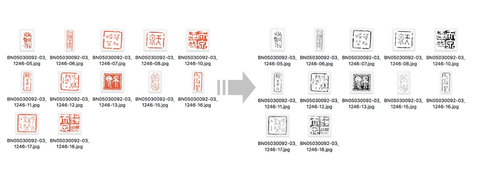

# ImageRetrival_ByUsingDeepFeatureTree
Generating Tree Structure Using Deep Features,Extracting the Most Similar Pictures Based on Multiple Similarity Computing

First use imageProcessing.py to preprocess your images in batches

```python
python3 imageProcessing.py ----ImageData_dir=--ImageData(default='--ImageData')

```
Then you can find the result image in the ‘/binary’ file,If you are doing Seal Image Retrieval,see:https://github.com/timcanby/collector-s_seal-ImageProcessing


Next, we extract the tree structure and do a retrieve test. The system framework is as follows：（about detailed technology:we will add a paper link in the future）


Use feature_extraction.py to get deep_feature from the image,by default, we use the block4_pool middle-level output of VGG19 Pre_trained model as the feature of tree structure extraction in this framework.
Run (if u have got the dir:'binary/'):
```python
python3 feature_extraction.py 
```
data_binary.npy and label_binary.npy Will be generated. Of course, you can modify the source code to save the data in other formats

Run :
```python
python3 F2X_processing.py 
```

To read the data and get your tree structure images_Tree.xml,next you can try a search experiment:

run:
```python
python3 Hog_extractor.py 
```
Obtain features for calculating similarity，of course you can train a Siamese network，It depends on the data you have.

Choose an image of your test and see the results by
```python
python3 search_example.py
```
You can get more similar images by adjusting the parameter 'degree'(from 0, take integers).The bigger the number 'degree', the more images you get. Be careful not to exceed the depth of the whole Imagetree.

The number of matchable images ranges from 1 to 20,000 (since we haven't tried more than 20,000 experiments yet)When there are 100 images in the target image, the tree image is formed as follows:


Borrowed Flask template：https://github.com/kudeh/image-search-engine, you can build your own retrieval application like：


Authors
-------

- @Kangying Li 


License
-------
